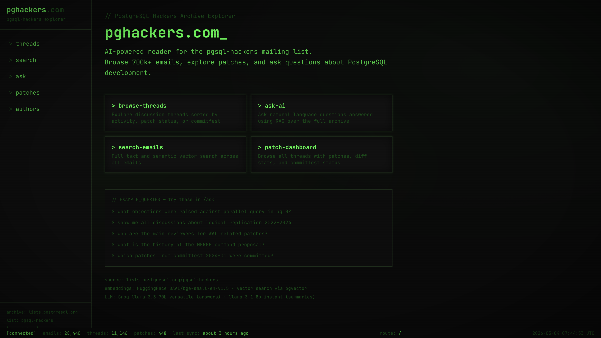

# Postgres Hackers Explorer

An AI-powered reader and explorer for the [pgsql-hackers](https://lists.postgresql.org/pgsql-hackers/) mailing list archive.

## Why This Project Exists

The pgsql-hackers mailing list is the primary communication channel for PostgreSQL development, containing over 700,000 emails spanning decades of technical discussions, patch submissions, and design debates. Navigating this archive is challenging due to its sheer volume and lack of modern search capabilities.

This project addresses that problem by providing:

- **Modern interface** - A web-based browser with filtering, sorting, and pagination
- **Intelligent search** - Both keyword and semantic search powered by vector embeddings
- **AI assistance** - Ask natural language questions and get answers with citations
- **Patch tracking** - Monitor patches by commitfest status
- **Contributor insights** - Explore author profiles and activity

## What You'll Find

- Thread browser with multiple sort options and filters
- Detailed thread views with email trees and diff viewers
- Semantic search for finding related discussions
- RAG-powered question answering over the full archive
- Patch dashboard with commitfest tracking
- Author directory with contribution statistics

## Documentation

- [Stack](STACK.md) - Technology choices and architecture
- [Features](FEATURES.md) - Detailed feature list
- [Setup](SETUP.md) - Installation and development guide
- [API](API.md) - API endpoints reference

## License

AGPL-3.0
